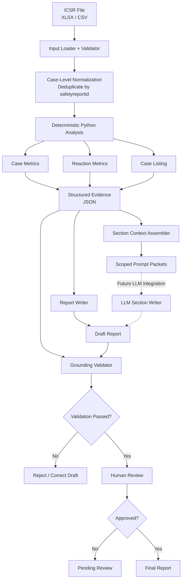

# PADER-Style Report Generator

A Python prototype for generating **evidence-grounded PADER-style drug safety reports** from structured ICSR data.

The project is built around a simple principle:

> **Use Python for exact calculations. Use AI only where natural-language generation adds value.**

Instead of asking an AI model to read a raw spreadsheet, calculate safety metrics, and write the report in one step, this project separates those responsibilities.

Python handles the calculations. Structured evidence stores the facts. AI-ready prompt packets receive only the information needed for each report section. The final output is validated against the calculated evidence before human review.

---

## Why I Built This

Large language models are useful for summarization and writing, but they are not the best tool for tasks such as:

- counting records
- deduplicating safety cases
- calculating percentages
- sorting reaction frequencies
- identifying reporting periods
- checking whether the correct number is attached to the correct statement

Those tasks can be handled more reliably with deterministic Python code.

The project therefore follows this flow:

```text
ICSR Data
   |
   v
Python Analysis
   |
   v
Structured Evidence
   |
   v
Section-Specific Context
   |
   v
Report Generation
   |
   v
Grounding Validation
   |
   v
Human Review
```

---

## Key Features

- Validates structured ICSR input data
- Deduplicates case-level records using `safetyreportid`
- Separates case-level and reaction-level counting
- Calculates:
  - unique safety cases
  - serious and non-serious cases
  - expedited / alert cases
  - demographic summaries
  - reporter summaries
  - country distributions
  - reaction occurrence frequencies
  - reaction outcomes
  - monthly reporting trends
  - seriousness criteria
- Generates a structured evidence JSON file
- Builds section-specific AI-ready prompt packets
- Generates a PADER-style Markdown report
- Performs claim-level grounding checks
- Detects unsupported causal or safety language
- Includes a human-review gate
- Includes **20 automated tests**

---

## Architecture



The main architectural boundary is between **calculation** and **language generation**.

Python owns the calculations.

A future AI model would receive only approved, section-specific evidence rather than the raw dataset.

---

## Python vs. AI

### Python handles

Anything that should be exact and reproducible:

- input validation
- case deduplication
- row counts
- unique case counts
- serious / non-serious classification
- alert-case counts
- percentages
- demographic analysis
- reaction occurrence counts
- outcome counts
- monthly trends
- case listings
- evidence-quality checks
- claim-level validation

### AI is intended for

Tasks where natural-language generation adds value:

- drafting regulatory-style narrative
- summarizing approved evidence
- describing numerical trends
- producing consistent section prose

The current prototype does **not** make a live LLM API call.

Instead, it generates AI-ready prompt packets showing exactly what a future model would receive.

This keeps the project reproducible and API-key free while preserving a clear AI integration boundary.

---

## Context Engineering

The project does not use one large prompt containing the entire spreadsheet.

Instead, each report section receives only the evidence it needs.

For example:

```text
Complete Evidence
       |
       +--> Narrative Summary Packet
       |
       +--> Trends Packet
       |
       +--> Future Section Packets
```

Each prompt packet contains:

```text
System Instruction
        +
Approved Evidence
        +
Counting Methodology
        +
Section Task
```

This reduces irrelevant context and makes generated claims easier to validate.

Example instructions include:

```text
Use only the approved evidence.

Do not compute new numbers.

Do not infer causality.

Do not declare a safety signal.

Do not invent missing regulatory context.

Do not treat reaction occurrences as unique safety cases.
```

---

## Evidence Layer

The analysis produces:

```text
analysis_evidence.json
```

This acts as the structured source of truth for report facts.

Conceptually:

```json
{
  "unique_cases": "...",
  "serious_cases": "...",
  "alert_cases": "...",
  "reporting_period": {
    "start": "...",
    "end": "..."
  }
}
```

The evidence also stores the meaning of important metrics.

For example:

```json
{
  "case_counting_methodology": {
    "unit": "unique_case",
    "deduplication_key": "safetyreportid"
  },
  "reaction_counting_methodology": {
    "unit": "reaction_occurrence"
  }
}
```

This matters because one safety case may contain multiple reactions.

A reaction count is therefore not automatically the same as a unique-case count.

---

## Grounding and Validation

A generated report should not be trusted simply because its numbers look plausible.

The validator checks:

- required evidence values
- required report sections
- important grounded claims
- selected claim/value relationships
- evidence-quality rules
- unsupported safety or causal language

For example:

```text
Evidence:

Total cases   = A
Serious cases = B
```

If the report accidentally uses:

```text
A were classified as serious
```

the number may be valid somewhere in the evidence, but it is attached to the wrong statement.

The validator is designed to catch selected cases like this.

This is stronger than only asking:

> "Does this number appear somewhere in the report?"

The more useful question is:

> **"Is the correct number being used for the correct claim?"**

---

## Automated Evaluation

Run the test suite with:

```powershell
python -m unittest discover -s tests -v
```

The current implementation contains **20 automated tests**.

The tests cover:

- synthetic unit tests
- missing-column failure handling
- real-data regression checks
- data invariants
- deterministic reaction ranking
- positive reaction counts
- counting methodology
- methodology content in the report
- evidence-to-report consistency
- reporting-period consistency
- unsupported safety claims
- unsupported causal claims
- deliberately corrupted case-count claims
- deliberately corrupted table values
- deliberately corrupted trend values
- deliberately corrupted reaction claims

A successful local run ends with:

```text
Ran 20 tests

OK
```

### Why the negative tests matter

The test suite deliberately creates incorrect reports and confirms that validation fails.

Examples include:

```text
wrong serious-case count
wrong case-volume table value
wrong highest-month value
wrong reaction occurrence count
```

This tests the system's ability to catch incorrect output rather than only confirming that correct output passes.

---

## Human Review

Successful automated validation does not automatically make the report final.

The project writes:

```text
human_review_status.json
```

A normal generated report remains:

```json
{
  "status": "pending_review"
}
```

The architecture deliberately separates:

```text
automated engineering checks
```

from:

```text
human / regulatory review
```

A real production implementation would also record reviewer identity, timestamps, report versions, comments, and an audit trail.

---

## Report Structure

The generated PADER-style report includes sections such as:

```text
Reporting Period

Methodology and Data Interpretation

Narrative Summary and Analysis

Summary Analysis of Cases

Reaction / Adverse Event Analysis

Serious Cases / 15-Day Alerts

Trends and Important Observations

History of Actions

Case Index / Listing
```

The Methodology section makes important counting assumptions visible directly in the report.

---

## Project Structure

```text
Pader-style-report-generator/
│
├── README.md
├── architecture.md
├── requirements.txt
│
├── src/
│   ├── __init__.py
│   └── pader_generator.py
│
├── tests/
│   └── test_pader_generator.py
│
├── prompts/
│   ├── base_system.md
│   ├── section_template.md
│   └── assembled_prompt_packets.md
│
├── version1/
│   └── version1_design.md
│
├── analysis_evidence.json
├── report_output.md
└── human_review_status.json
```

---

## Installation

Clone the repository:

```powershell
git clone https://github.com/mirayanali5/Pader-style-report-generator.git
cd Pader-style-report-generator
```

Install dependencies:

```powershell
python -m pip install -r requirements.txt
```

---

## Usage

Run the generator with an ICSR XLSX or CSV file:

```powershell
python src/pader_generator.py --data "path/to/icsr_data.xlsx"
```

Optional output arguments are available for the report, evidence, prompt packets, review status, and listing size.

Example:

```powershell
python src/pader_generator.py ^
  --data "path/to/icsr_data.xlsx" ^
  --out "report_output.md" ^
  --evidence-out "analysis_evidence.json"
```

To demonstrate the approval state after human review:

```powershell
python src/pader_generator.py --data "path/to/icsr_data.xlsx" --approve
```

---

## Dataset

The original development dataset is **not included in this public repository**.

The project expects ICSR-style structured data containing fields used by the analysis pipeline, such as:

```text
safetyreportid
receivedate
occurcountry
serious
fulfillexpeditecriteria
patient_reaction_reactionmeddrapt
patient_reaction_reactionoutcome
```

Additional required fields are defined in:

```text
src/pader_generator.py
```

For public demonstrations, a synthetic or appropriately licensed dataset should be used.

---

## Running the Tests

Some regression tests depend on the development dataset.

If you have an appropriate local dataset, set its location:

### Windows CMD

```bat
set GENAR_DATA_PATH=C:\path\to\icsr_data.xlsx
python -m unittest discover -s tests -v
```

### PowerShell

```powershell
$env:GENAR_DATA_PATH="C:\path\to\icsr_data.xlsx"
python -m unittest discover -s tests -v
```

The dataset itself is intentionally not distributed with the repository.

---

## Why No Agent Framework?

The workflow is already known:

```text
load
  ->
validate
  ->
analyze
  ->
build evidence
  ->
generate
  ->
validate
  ->
review
```

There is no need for an AI agent to decide what step should happen next.

An agent framework would add complexity without providing useful autonomy for the current problem.

The project therefore uses explicit Python orchestration.

---

## Why No RAG?

The current prototype works from one structured ICSR dataset.

Directly accessing structured fields is simpler and more reliable than using vector search or retrieval.

RAG would become useful if a future version needed information from external sources such as:

- product labels
- CCDS documents
- previous periodic reports
- regulatory correspondence
- safety-action records
- clinical study reports
- risk-management documents

At that point, retrieval could be added only to the sections that actually need it.

---

## Roadmap

A future version could evolve into a more general regulatory-reporting platform.

Potential improvements include:

- live LLM section generation
- structured LLM output
- full claim-level evidence provenance
- configurable report types
- reusable analysis functions
- section-specific generation rules
- PADER / PSUR / PBRER / DSUR support
- previous-period comparisons
- external label/document retrieval
- dataset versioning
- prompt versioning
- model versioning
- report versioning
- section-level regeneration
- reviewer audit trails
- stronger semantic grounding evaluation

The goal is to support additional regulatory report types without moving numerical calculations into the AI model.

---

## Design Philosophy

The project intentionally avoids adding AI components simply for complexity.

The core idea is:

```text
Python calculates the facts.

Structured evidence stores the facts.

AI can help communicate the facts.

Validation checks the output.

Humans make the final decision.
```

---

## Limitations

This is a prototype and is **not intended for production regulatory use**.

Current limitations include:

- no live LLM integration
- deterministic narrative generation
- primarily rule-based grounding validation
- selected claim-level checks rather than full sentence-level provenance
- no expectedness analysis without an appropriate product label / CCDS
- no SOC analysis where SOC data is unavailable
- no exposure denominator for incidence calculations
- no independent causal assessment
- no independent safety-signal determination
- lightweight human-review workflow
- no production security or audit infrastructure

The project demonstrates the engineering architecture rather than replacing medical, pharmacovigilance, or regulatory review.

---

## Tech Stack

- **Python**
- **Pandas**
- **JSON**
- **Markdown**
- **unittest**
- **Mermaid**
- AI-ready prompt/context design

---

## Status

```text
20 automated tests passing
Claim-level grounding checks implemented
Deterministic report generation implemented
AI integration boundary designed
Human-review gate implemented
```

---

## Author

**Mir Ayan Ali**

GitHub: [mirayanali5](https://github.com/mirayanali5)
