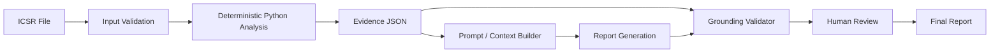

# PADER-Style Report Generator

A Python-based prototype for generating **evidence-grounded PADER-style drug safety reports** from structured ICSR data.

The project follows one core principle:

> **Use Python for exact calculations. Use AI only where natural-language generation adds value.**

Instead of asking an LLM to calculate safety metrics directly from a spreadsheet, Python handles deterministic analysis such as case deduplication, counts, percentages, reaction frequencies, and trends. The calculated results are stored as structured evidence and used to generate and validate the report.

---

## Features

- Loads and validates ICSR data from Excel/CSV
- Deduplicates safety cases using `safetyreportid`
- Calculates case, seriousness, demographic, reaction, outcome, and monthly trend metrics
- Separates unique-case counts from reaction-occurrence counts
- Generates structured evidence in JSON
- Creates section-specific AI-ready prompt packets
- Generates a PADER-style Markdown report
- Validates important report claims against calculated evidence
- Detects unsupported causal and safety language
- Includes a human-review approval step
- Includes **20 automated tests**

---

## Architecture



The important design decision is the separation between **calculation** and **language generation**.

Python calculates the facts. A future LLM receives only approved, section-specific evidence rather than the raw spreadsheet.

---

## Python vs. AI

### Python

Python handles anything that needs to be exact and reproducible:

- case deduplication
- counts and percentages
- serious/non-serious classification
- reaction frequencies
- demographic summaries
- monthly trends
- case listings
- evidence validation
- claim-level grounding checks

### AI

AI is intended for:

- drafting regulatory-style narrative
- summarizing approved evidence
- describing numerical trends

The current prototype does **not** make a live LLM API call.

Instead, it generates section-specific prompt packets in:

```text
prompts/assembled_prompt_packets.md
```

This demonstrates how an LLM can later be integrated without giving it responsibility for numerical analysis.

---

## Grounding and Validation

Calculated facts are stored in:

```text
analysis_evidence.json
```

This file acts as the structured source of truth for the report.

The validator checks that:

- required report sections exist
- important evidence reaches the report
- numerical values are attached to the correct claims
- unsupported causal or safety conclusions are not introduced

For example, if the evidence contains different values for total cases and serious cases, the validator can detect when the total-case number is incorrectly used in a serious-case statement.

---

## Project Structure

```text
Pader-style-report-generator/
│
├── README.md
├── architecture.md
├── requirements.txt
│
├── src/
│   └── pader_generator.py
│
├── tests/
│   └── test_pader_generator.py
│
├── prompts/
│   ├── base_system.md
│   ├── section_template.md
│   └── assembled_prompt_packets.md
│
├── version1/
│   └── version1_design.md
│
├── analysis_evidence.json
├── report_output.md
└── human_review_status.json
```

---

## Installation

Clone the repository:

```powershell
git clone https://github.com/mirayanali5/Pader-style-report-generator.git
cd Pader-style-report-generator
```

Install dependencies:

```powershell
python -m pip install -r requirements.txt
```

---

## Usage

Generate a report:

```powershell
python src/pader_generator.py --data "path/to/icsr_data.xlsx"
```

The generator creates:

```text
report_output.md
analysis_evidence.json
prompts/assembled_prompt_packets.md
human_review_status.json
```

After human review, approval can be recorded with:

```powershell
python src/pader_generator.py --data "path/to/icsr_data.xlsx" --approve
```

---

## Testing

Run the automated test suite:

```powershell
python -m unittest discover -s tests -v
```

The project currently contains **20 automated tests** covering:

- deterministic case calculations
- data validation
- reaction analysis
- counting methodology
- evidence-to-report consistency
- reporting-period consistency
- claim-level grounding
- corrupted numerical claims
- unsupported causal language
- unsupported safety conclusions

Current result:

```text
Ran 20 tests

OK
```

---

## Dataset

The original development dataset is **not included in this public repository**.

To run dataset-dependent regression tests locally:

### Windows CMD

```bat
set GENAR_DATA_PATH=C:\path\to\icsr_data.xlsx
python -m unittest discover -s tests -v
```

For public demonstrations, a synthetic or appropriately licensed ICSR dataset should be used.

---

## Why This Architecture?

The workflow is intentionally simple:

```text
Structured data
      ↓
Deterministic analysis
      ↓
Approved evidence
      ↓
Report generation
      ↓
Validation
      ↓
Human review
```

An agent framework is unnecessary because the workflow is known in advance.

RAG is also unnecessary for the current structured dataset. It could become useful in a future version for retrieving information from product labels, previous reports, regulatory correspondence, or other documents.

---

## Limitations

This is a prototype and is **not intended for production regulatory use**.

Current limitations include:

- no live LLM integration
- rule-based grounding validation
- no expectedness analysis without a product label/CCDS
- no SOC analysis when SOC data is unavailable
- no exposure denominator for incidence calculations
- no independent causality or safety-signal determination
- lightweight human-review workflow

---

## Tech Stack

**Python · Pandas · JSON · Markdown · unittest · Mermaid**

---

## Future Improvements

- Live LLM narrative generation
- Structured LLM outputs
- Full claim-level evidence provenance
- Support for additional regulatory report types
- Previous-period comparison
- Product-label/document retrieval
- Report and prompt versioning
- Reviewer audit trails

---
