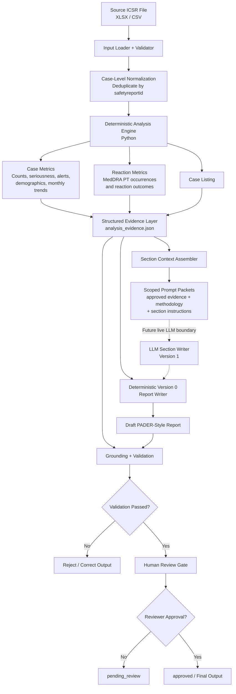

# Architecture



## Design Boundary

The most important architectural decision is the boundary between **deterministic analysis** and **language generation**.

Python owns operations that must be exact and reproducible:

- input validation
- case deduplication
- counts
- percentages
- seriousness and expedited-case calculations
- demographic grouping
- monthly trends
- reaction occurrence counting
- reaction outcome counting
- case listings
- evidence-quality checks
- grounding validation

The language-generation layer does **not** receive the raw spreadsheet and is not responsible for calculating these values.

Instead, deterministic analysis produces:

```text
analysis_evidence.json
```

which acts as the structured source of truth.

---

## Case-Level vs. Reaction-Level Analysis

The pipeline deliberately separates different units of analysis.

### Case-level

```text
Source rows
    |
    v
Deduplicate using safetyreportid
    |
    v
Unique safety cases
```

Case-level metrics include:

- unique cases
- serious cases
- non-serious cases
- expedited / alert cases
- demographics
- country
- reporter qualification
- monthly case counts
- case listing

### Reaction-level

```text
Reaction field
    |
    v
Split MedDRA Preferred Terms
    |
    v
Reaction occurrences
```

Reaction-frequency counts are therefore **reaction occurrences**, not unique-case counts.

This distinction is stored explicitly in the evidence so downstream generation does not have to infer what a number represents.

---

## Context Engineering

The architecture uses section-specific context rather than sending all available information to every generation step.

```text
analysis_evidence.json
        |
        +--------------------------+
        |                          |
        v                          v
Narrative evidence          Trend evidence
        |                          |
        v                          v
Narrative prompt            Trend prompt
```

Each packet contains:

```text
system instruction
        +
approved section evidence
        +
counting methodology where relevant
        +
section task
```

This reduces unnecessary context and limits the opportunity for unsupported calculations or conclusions.

---

## Grounding and Validation

The generated report is checked against deterministic evidence.

```text
Evidence JSON ----------------+
                              |
                              v
Generated Report ------> Grounding Validator
                              |
                              v
                     Pass / Fail Decision
```

Validation includes:

- required evidence presence
- required report sections
- required grounded claims
- selected claim/value consistency checks
- evidence-quality checks
- unsupported-language detection

For example:

```text
Evidence

unique cases  = 1024
serious cases = 1023
```

A generated claim such as:

```text
1024 (99.9%) were classified as serious
```

fails validation even though `1024` is itself a valid number elsewhere in the evidence.

This is important because grounding means attaching the **correct evidence to the correct claim**, not merely using numbers that happen to exist in the source.

---

## Human-in-the-Loop Boundary

Passing automated validation does not make the report final.

```text
Generated report
      |
      v
Automated validation
      |
      v
pending_review
      |
      v
Human reviewer
      |
      v
approved
```

Version 0 represents this through:

```text
human_review_status.json
```

The human-review gate is intentionally separate from automated validation.

---

## AI Boundary

Version 0 does not make a live LLM call.

The prompt packets demonstrate where AI would be introduced:

```text
Deterministic Evidence
        |
        v
Scoped Context Packet
        |
        v
Future LLM Section Writer
        |
        v
Grounding Validation
```

The future LLM would be responsible for language generation, not numerical analysis.

This keeps deterministic tasks deterministic while using the model only where natural-language generation adds value.

---

## Why No Agents or RAG?

No agent framework is required for Version 0.

The workflow is known in advance:

```text
load
  ->
validate
  ->
analyze
  ->
assemble evidence
  ->
generate
  ->
validate
  ->
review
```

Autonomous planning would add complexity without improving this workflow.

RAG is also unnecessary for the supplied task because the primary source is one structured spreadsheet. Direct deterministic access to the required columns is simpler and more reliable.

Retrieval would become useful if a future version needed evidence from sources such as:

- product labels / CCDS
- previous periodic reports
- regulatory correspondence
- safety action histories
- clinical study documents
- large regulatory document repositories

---

## Generalization

The architecture separates:

```text
data ingestion
      |
analysis functions
      |
evidence
      |
section configuration
      |
generation
      |
validation
      |
review
```

A future implementation could therefore support additional report types such as:

```text
PADER
PSUR
PBRER
DSUR
CSR
```

without moving calculations into the LLM or rewriting the entire pipeline.

Report-specific behavior could instead be represented through configuration defining:

- required sections
- required evidence
- required analyses
- prompt instructions
- validation rules