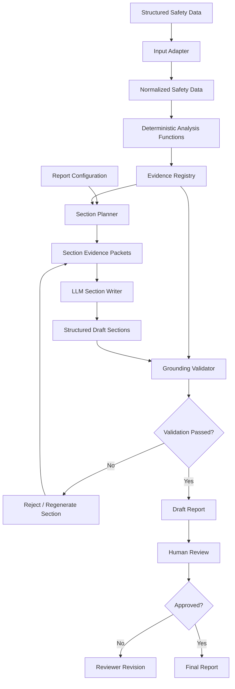

# Version 1 Design — Generalized Regulatory Report Generation

## Goal

Version 0 demonstrates a working PADER-style pipeline for a single structured ICSR dataset.

Version 1 would generalize the same architecture so additional regulatory report types can reuse the ingestion, deterministic analysis, evidence, generation, validation, and human-review layers without moving numerical reasoning into an LLM.

The main principle remains:

```text
Deterministic code calculates facts.
LLMs generate language from approved facts.
Validation checks generated claims.
Humans approve final regulatory output.
```

---

## Proposed Architecture



---

## 1. Configurable Report Types

Version 0 contains PADER-specific report structure.

Version 1 would move report requirements into configuration.

For example:

```yaml
report_type: PADER

sections:
  - id: narrative_summary
    required_evidence:
      - unique_cases
      - serious_cases
      - alert_cases
      - top_reactions
      - monthly_cases

  - id: case_summary
    required_evidence:
      - age_groups
      - sex
      - countries
      - reporter_qualification

  - id: reaction_analysis
    required_evidence:
      - top_reactions
      - serious_reactions
      - outcomes
```

A different report type could provide another configuration while reusing the same underlying pipeline.

This avoids implementing every future report as a separate monolithic program.

---

## 2. Evidence Registry

Instead of allowing report writers to access arbitrary source data, deterministic analysis functions would publish named evidence objects.

Conceptually:

```text
unique_cases
serious_cases
alert_cases
age_groups
sex_distribution
country_distribution
reaction_occurrences
reaction_outcomes
monthly_case_counts
case_listing
```

Each evidence item would include metadata such as:

```json
{
  "evidence_id": "serious_cases",
  "value": 1023,
  "unit": "unique_case",
  "source_field": "serious",
  "deduplication_key": "safetyreportid"
}
```

This makes the meaning and provenance of evidence explicit.

The section-generation layer requests evidence by ID rather than receiving the entire dataset.

---

## 3. Section-Level Context Engineering

Version 1 would continue the scoped-context approach demonstrated in Version 0.

For each section:

```text
Report configuration
        +
required evidence IDs
        |
        v
Evidence registry
        |
        v
Minimal section context
        |
        v
LLM
```

For example, the Trends section does not need the complete case listing.

It might receive only:

```text
monthly case counts
highest month
lowest month
selected reaction frequencies
counting methodology
```

This reduces irrelevant context and makes generated claims easier to validate.

---

## 4. LLM Responsibilities

The LLM would be used for tasks where language generation adds value:

- drafting regulatory-style narrative
- summarizing deterministic evidence
- describing numerical trends
- producing consistent section prose
- revising a section after validation or reviewer feedback

The LLM would not be responsible for:

- counting source rows
- deduplicating safety cases
- calculating percentages
- determining reporting-period dates
- calculating reaction frequencies
- computing monthly totals
- inventing missing expectedness information
- independently declaring causal relationships or safety signals

A section request would conceptually contain:

```text
SYSTEM INSTRUCTION
+
SECTION-SPECIFIC APPROVED EVIDENCE
+
DATA SEMANTICS / METHODOLOGY
+
SECTION TASK
```

Structured output would be preferred so generated claims can be inspected before rendering.

---

## 5. Claim-Level Provenance

Version 0 performs explicit grounding checks for selected important claims.

Version 1 would extend this to structured claim provenance.

For example:

```json
{
  "text": "A total of 1,024 unique safety cases were identified.",
  "evidence_ids": [
    "unique_cases"
  ]
}
```

A trend statement could be represented as:

```json
{
  "text": "The highest monthly case volume was 109 cases in July 2025.",
  "evidence_ids": [
    "monthly_cases.2025-07"
  ]
}
```

The validator could then check each factual claim against its referenced evidence before the section is accepted.

This is stronger than checking whether evidence values merely occur somewhere in generated prose.

---

## 6. Validation Pipeline

Version 1 would use multiple validation layers.

```text
Generated section
       |
       v
Schema validation
       |
       v
Evidence-reference validation
       |
       v
Numerical grounding checks
       |
       v
Unsupported-claim checks
       |
       v
Section completeness checks
       |
       v
Human review
```

A failed section would be rejected rather than silently included in the final report.

Where appropriate, only that section would be regenerated.

This keeps failures local and avoids regenerating an entire report because one section contains an unsupported claim.

---

## 7. Human Review and Auditability

Human review remains mandatory.

Version 1 would extend the simple Version 0 review status into an audit record containing:

```text
report version
dataset version
prompt version
model/version
generation timestamp
validation results
reviewer
review timestamp
approval status
review comments
```

A report would not become final simply because automated validation passed.

This separates:

```text
machine validation
```

from:

```text
regulatory / medical approval
```

---

## 8. Retrieval and External Documents

RAG is intentionally not required for Version 0 because the supplied task uses one structured spreadsheet.

Version 1 would introduce retrieval only when a report section genuinely requires external evidence.

Possible examples include:

```text
product label / CCDS
previous periodic reports
regulatory correspondence
safety action history
clinical study reports
risk-management documents
```

For example, expectedness analysis requires an appropriate reference label.

The architecture could retrieve the relevant label section and provide it to the specific expectedness workflow rather than placing an entire document repository into every prompt.

Therefore retrieval is added only where lookup is necessary.

---

## 9. Agent / Tool Strategy

Version 1 would not use a general autonomous agent for the entire report.

The workflow is sufficiently structured that explicit orchestration is safer:

```text
determine report configuration
        |
calculate required evidence
        |
assemble section context
        |
generate section
        |
validate section
        |
human review
```

Tools would be introduced for specific capabilities where they provide clear value, such as:

```text
database queries
label/document retrieval
MedDRA terminology lookup
report rendering
validation
```

The system would therefore favor explicit workflows and specialized tools over unnecessary autonomous agents.

---

## 10. Generalization Beyond PADER

The reusable components would remain:

```text
Input adapters
      |
Normalized safety data
      |
Analysis functions
      |
Evidence registry
      |
Section planner
      |
Generation
      |
Validation
      |
Human review
```

Report-specific configuration could define the differences between workflows such as:

```text
PADER
PSUR
PBRER
DSUR
CSR
```

Not every analysis would apply to every report type.

The configuration determines which evidence and sections are required while the core infrastructure remains reusable.

---

## Version 0 → Version 1

| Version 0 | Version 1 |
|---|---|
| One PADER-style workflow | Configurable report types |
| Deterministic report narrative | LLM-assisted section narrative |
| Evidence JSON | Evidence registry with provenance |
| Scoped example prompt packets | Runtime section context assembly |
| Selected claim-level checks | Structured claim-level provenance |
| Whole-report validation | Section + report validation |
| Simple approval flag | Reviewer audit trail |
| One structured source | Optional retrieval where required |
| No model dependency | Versioned model integration |

---

## Why This Version 1

The objective is not to add more AI components.

It is to preserve the reliability demonstrated in Version 0 while using an LLM only where it provides useful language-generation capability.

The proposed system therefore keeps:

```text
calculations deterministic
context scoped
evidence explicit
generation constrained
claims traceable
validation independent
human approval mandatory
```

This allows the prototype to grow beyond one PADER-style report without requiring the entire system to be rewritten.